# Información general.
**Nombre:** Ailyn Hernández Hermosillo
**Numero de control** 22151242
**Materia:** Programación Web
**Actividad:** CRUD de Estudiantes en Laravel

---

# CRUD de Estudiantes y Carreras en Laravel 12 y Tailwind

Proyecto desarrollado como parte de la actividad de la unidad 3 de la materia Programación Web. 
Permite administrar una **lista de estudiantes** y **carreras**, aplicando los principios MVC y prácticas del framework.

---

## Tecnologías utilizadas

- **Laravel 12**
- **PHP 8.3**
- **Tailwind CSS (colores pastel rosa)**
- **SQLite** (base de datos ligera incluida)
- **Vite** para compilar estilos y scripts

---

## Funcionalidades

1. Crear, editar, listar y eliminar **Estudiantes**  
2. Crear, editar, listar y eliminar **Carreras**  
3. Validación de formularios con mensajes de error a
4. Estilos personalizados con **Tailwind** (tema rosa pastel)  
5. Interfaz limpia y responsiva
6. Mensajes de éxito y confirmación de acciones del usuario

---

##  Campos del sistema
### Estudiantes
- Nombre  
- Correo  
- Carrera (relación con la tabla carreras)  
- Semestre  

### Carreras
- Nombre de la carrera  

---

## Capturas de pantalla

### Estudiantes
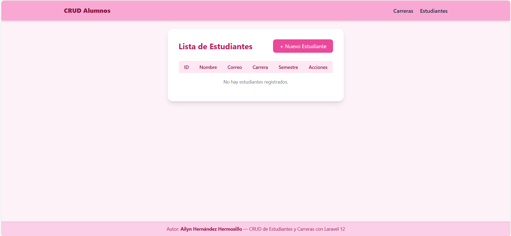

### Carreras
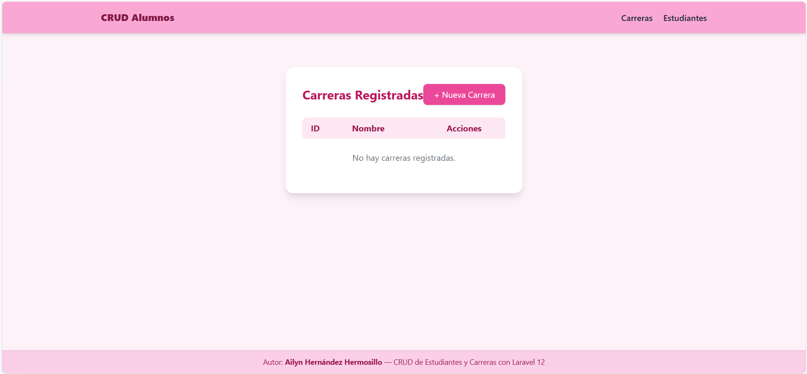

### Formulario de Registro
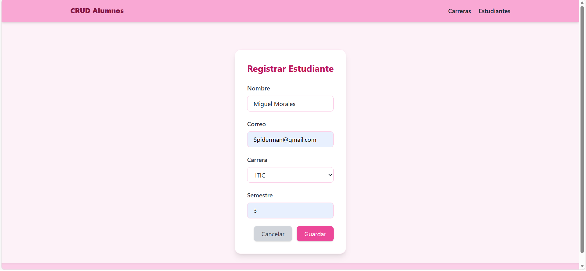
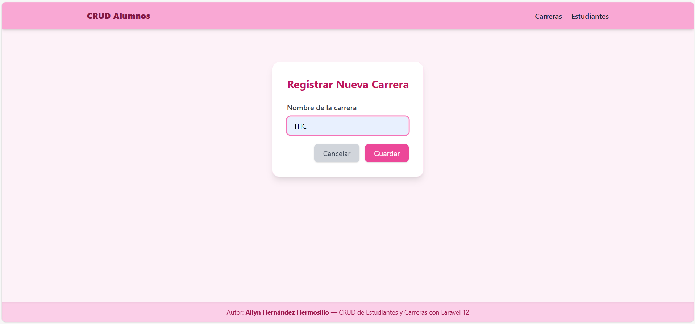

### Registro agregado
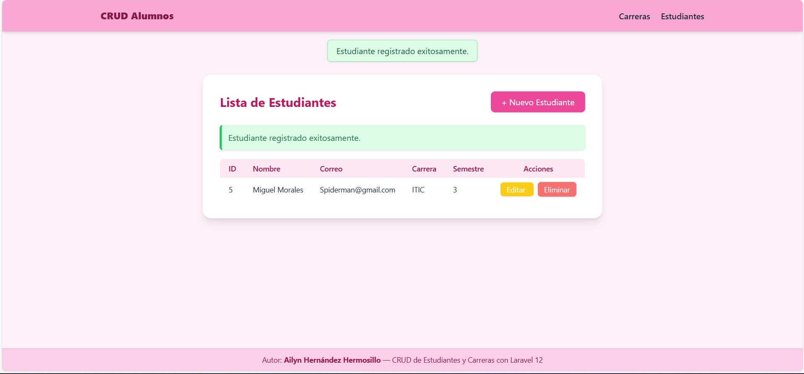

### Actualizar Registro
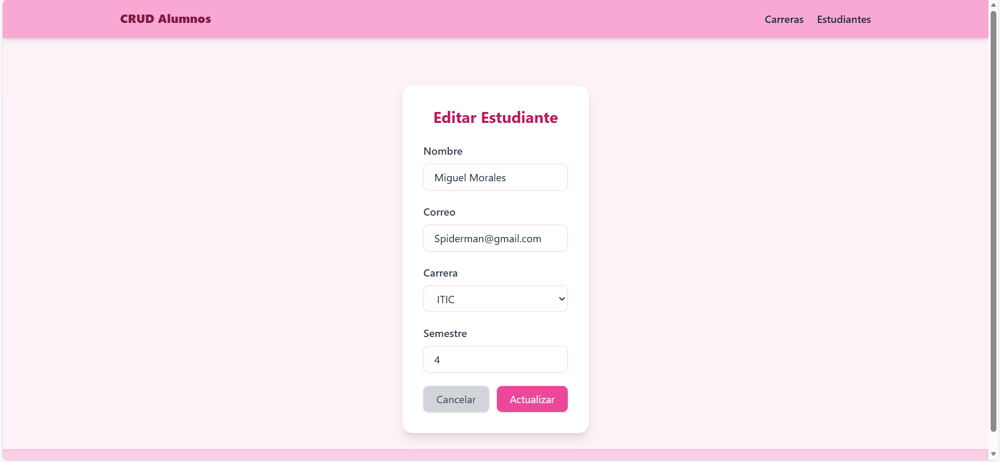
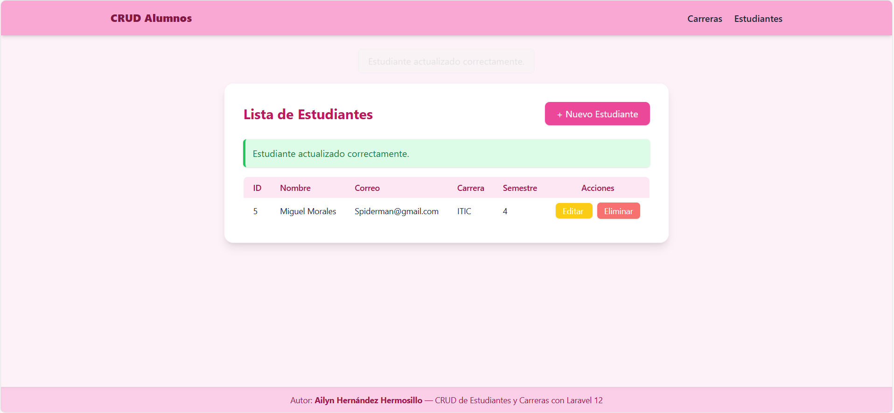
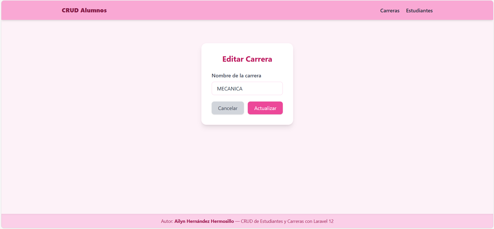
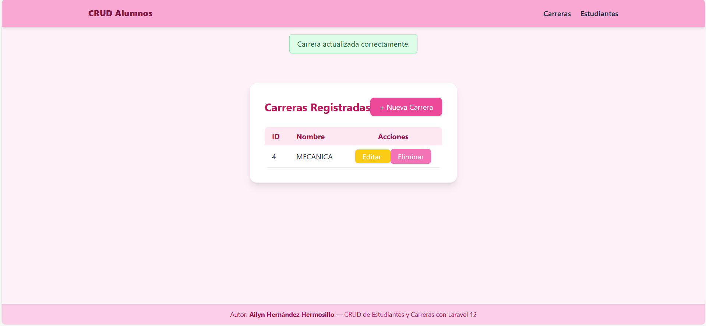

### Actualizar Registro
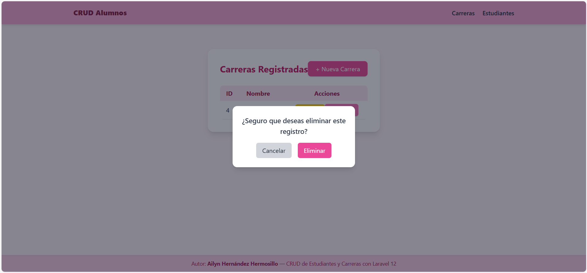
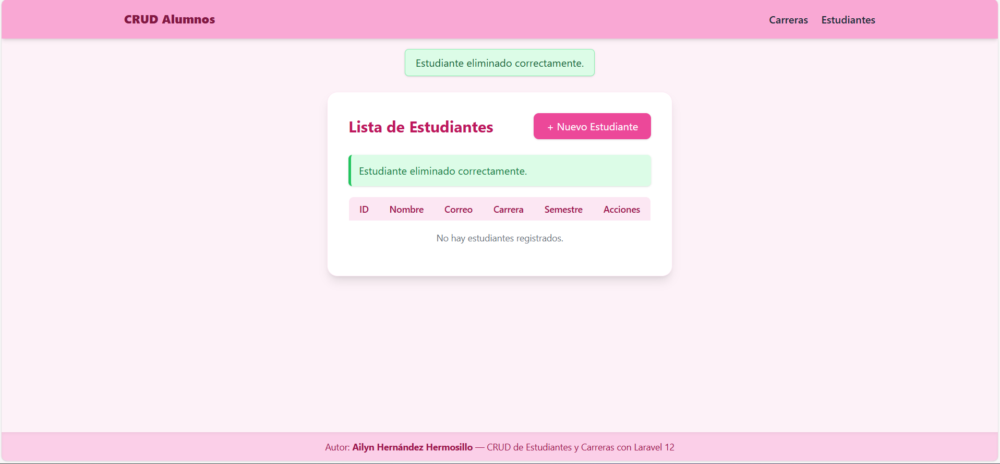
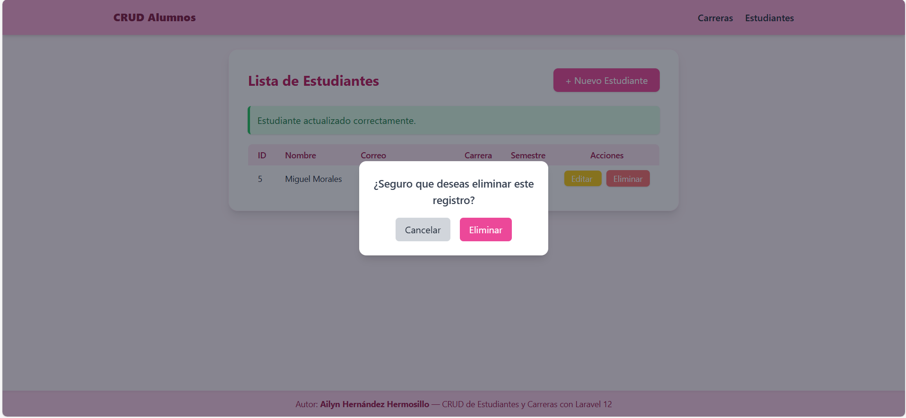
